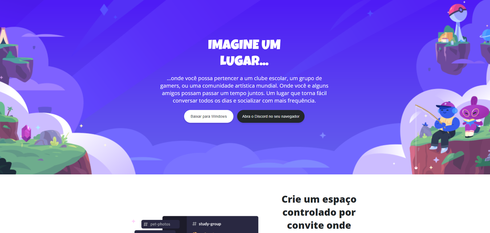

## 👨‍💻 Desafio de Projeto CSS: Construindo um Layout Responsivo para o Site do Discord com CSS
Este projeto consiste na criação de um clone da página do Discord utilizando HTML e CSS, com foco em responsividade e na abordagem *mobile first*. O desafio foi proposto pela expert Michele Ambrosio, como parte da Formação CSS Developer oferecida na plataforma educacional DIO.

## 💻 Tecnologias Utilizadas:
<div style="display: inline_block">
  
  
</div>

## 🖥 Visualização:

Versão do site em um dispositivo desktop:
<div>
  
</div>

<br>

Versão do site em dispositivos menores, como celulares:
<div>
  
</div>

## 🚀 Como Executar Este Projeto:
1. **Clonar o Repositório:** Para clonar este projeto, use o seguinte comando no terminal:
   ```bash
   git clone https://github.com/reynanc/Projeto_site_clone_discord.git

## 🤔 O que foi feito nesse projeto:
- Criei um clone da página do Discord usando os conceitos de mobile first e responsividade;
- Usei as unidades de medidas relativas, aqui nesse projeto optei pel unidade de medida relativa `rem`;
- Neste projeto segui as orientações do arquivo do Figma disponibilizado no curso.

## 📌 Créditos
- **Assets:** Disponível no protótipo do Figma disponibilizado no curso.
